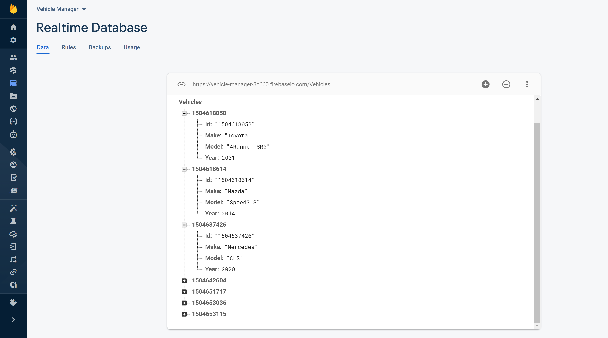

# Vehicle Manager Android Application
 

This Android Application incorporates CRUD functionallity on a Vehicle Management System.

### Getting Started
* This application is written in Java and uses Gradle
* To run this application open the project in Android Studio or use Gradle Wrapper
via the command line interface. 

* If the project does not run on Android studio please ensure that your machine is running a recent version of Android Studio; if 
you need to download a new version, you can find one [here](https://developer.android.com/studio).

### The Project
Overall, it was a great experience because it was fun, and I learned new things throughout the process. My future plans are to modify the list by displaying the object in a card view where the elements are nice and structured. Feel free to download the application and interact with it. This application uses a real-time database, so you will always have the latest vehicles on your phone.

### Database Structure
For this application I decided to use Firebase Database. I wanted to go with a NoSQL database for
a couple of reasons.
* Firebase REST API services allows us to take advantage of the cloud, which can be reliable in performance and security.
* Since my data structure is not too complex, we could use a flatter database.
* More importantly, it is very fast and it can scale if we need to add complexity in the future.

I decided to make the vehicle's id the parent node of each vehicle object since we will need to interact with the vehicle ID continually. The vehicle ID is a unique-id so using this unique-id is the best way to identify the vehicles. Doing so has made the process simple when deleting, editing, and fetching from my database.

### Project Structure
For this project I decided to use the MVC(Model View Controller) design patern.

#### Model
* Vehicle.java - The model class for what we define a vehicle to be.
* FirebaseDatabaseManager.java - Model class for making transactions with the database.

#### View
This consists of all the layouts for the application.
* activity_main.xml - the main container for the application that contains our buttons and list(client)
* simple_list_item.xml
* vehicle_display_data.xml
* vehicle_delete_by_id_form.xml 
* vehicle_edit_form.xml
* vehicle_entry_form.xml
* vehicle_edit_by_id_form.xml
* vehicle_get_by_id.xml

#### Controler
* MainActivity.java - contains the controller code for handling view interactions as well as sending and recieving the appropriate data to the appropriate instances.
* OnClickListenerAddVehicle
* OnClickListenerDeleteVehicle
* OnClickListenerEditVehicle
* OnClickListenerEditVehicleForm
* OnClickListenerGetVehicle
* OnClickListenerGetVehicleDisplay

#### Interfaces
I included some interfaces to help our client interact with the REST API services
* FirebaseManager
* Utils

### Testing
* I performed simple unit tests as well as instrumented tests to ensure app functionallity is working fine.
* Used Junit4 and Espresso for all tests.
