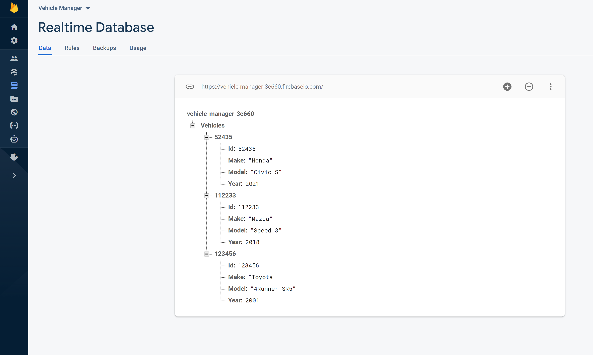

# Vehicle Manager Android Application
 

This Android Application incorporates CRUD functionallity on a Vehicle Management System.

### Getting Started
* This application is written in Java and uses Gradle
* To run this application open the project in Android Studio or use Gradle Wrapper
via the command line interface. 

* If the project does not run on Android studio please ensure that your machine is running a recent version of Android Studio; if 
you need to download a new version, you can find one [here](https://developer.android.com/studio).

### Database Structure
For this application I decided to use Firebase Database. I wanted to go with a NoSQL database for
a couple of reasons.
* Firebase allows us to take advantage of the cloud, which can be reliable.
* Since my data structure is not too complex, we could use a flatter database.
* This project does not benefit too much from relational databases since there aren't that many things to keep track of. However, if this project were to require a little more complexity, we could also use another Firebase service which is Firebase store.
* More importantly, it is very fast and it can scale if we need to add complexity in the future.

I decided to make the vehicle's id the parent node of each vehicle object since we will need to get and delete by the vehicle's id.
This has made the process simple when deleting, editing, and fetching from my database.

